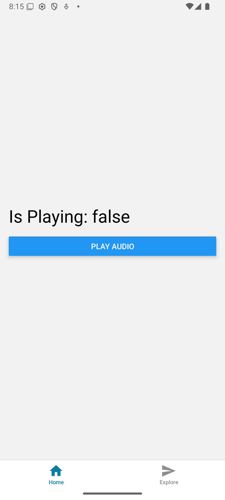
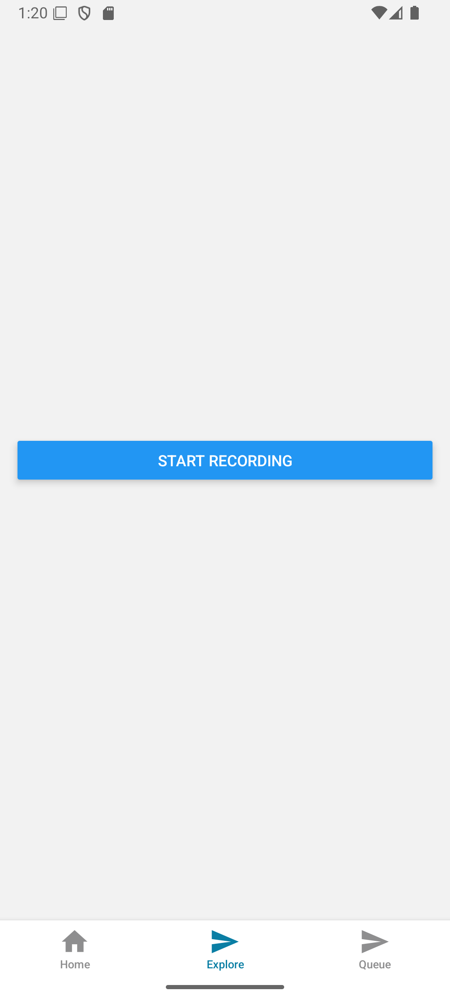

# expo-audio-playing-and-streaming

- YouTube: https://www.youtube.com/watch?v=XxnfBi9AH3s

# Audio Playing:

# Audio Streaming:

# Credits:

- The native module of audio streaming is created by Claude Sonnet using GitHub Copilot AI Agent. And I've tested on android.

# Related:

https://github.com/software-mansion/react-native-audio-api/issues/626
